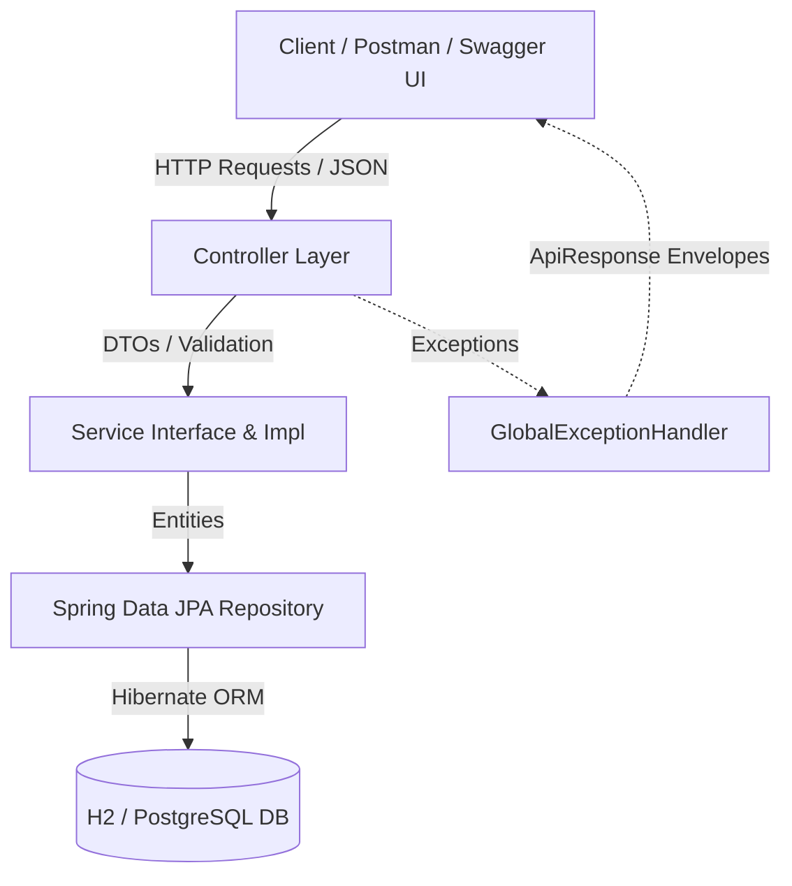
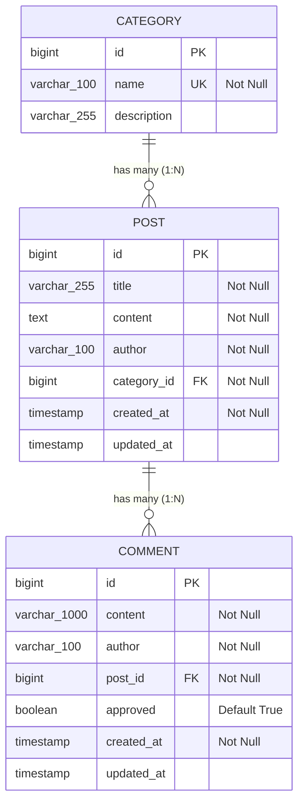

# 📝 Blog Management REST API

A production-ready, enterprise-grade RESTful API for a modern **Blog Management System** engineered with **Spring Boot 3.2.5**, **Spring Data JPA**, **Hibernate ORM**, **Jakarta Bean Validation**, and documented interactively with **OpenAPI 3 / Swagger UI**.

---

## 📑 Table of Contents
1. [Project Overview](#-project-overview)
2. [Key Features](#-key-features)
3. [Architecture & Design Principles](#-architecture--design-principles)
4. [Technology Stack](#-technology-stack)
5. [Database Schema & Entity Relationships](#-database-schema--entity-relationships)
6. [Project Directory Hierarchy](#-project-directory-hierarchy)
7. [Installation & Setup Guide](#-installation--setup-guide)
8. [Configuration & Environments](#-configuration--environments)
9. [Comprehensive API Documentation](#-comprehensive-api-documentation)
10. [Sample Requests, Responses & `curl` Commands](#-sample-requests-responses--curl-commands)
11. [Error Handling & Validation Structure](#-error-handling--validation-structure)
12. [Testing & Quality Assurance](#-testing--quality-assurance)
13. [Postman Collection Usage](#-postman-collection-usage)
14. [Quality Standards Checklist](#-quality-standards-checklist)

---

## 🌟 Project Overview

The **Blog Management REST API** provides a centralized backend service for publishing, organizing, moderating, and searching blog content. Designed following RESTful best practices, the system separates concerns into distinct presentation (Controller), business logic (Service), and persistence (Repository) layers.

### Core Objectives:
- **Resource Management**: Seamless CRUD operations for blog posts, topic categories, and interactive comments.
- **Relational Integrity**: Strict cascading rules, foreign key constraints, and orphan removal across categories, posts, and comments.
- **Data Validation & Safety**: Strong input sanitization and descriptive error feedback for invalid client payloads.
- **Developer Experience**: Auto-seeding of mock data, interactive Swagger UI documentation, and bundled Postman collection.

---

## ✨ Key Features

- ✅ **Full CRUD Operations**: Endpoints for Categories, Blog Posts, and Nested Comments.
- ✅ **Dynamic Pagination & Sorting**: Query blog posts using customizable `page`, `size`, and multi-field `sort` (e.g., `sort=createdAt,desc`).
- ✅ **Comment Moderation System**: Endpoint for flagging, approving, or rejecting comments (`PATCH /api/comments/{id}/moderation`).
- ✅ **Category Association Filtering**: Instant retrieval of posts by category identifier (`/api/posts/category/{categoryId}`).
- ✅ **Author Lookup & Filtering**: Query posts and comments written by specific authors.
- ✅ **Global Exception Handling**: Centralized error interceptor (`@RestControllerAdvice`) delivering uniform JSON error envelopes.
- ✅ **Jakarta Bean Validation**: Multi-constraint validation (`@NotBlank`, `@Size`, `@NotNull`) with field-by-field error mappings.
- ✅ **Interactive OpenAPI 3.0 / Swagger UI**: Live API explorer with executable endpoints at `/swagger-ui.html`.
- ✅ **Multi-Environment Profiles**:
  - `dev`: High-speed in-memory H2 database with Web Console (`/h2-console`) and preloaded sample datasets.
  - `prod`: Robust PostgreSQL database configuration ready for containerized or cloud environments.
- ✅ **Automated Test Coverage**: Complete suite of Unit Tests (Mockito) and Web Layer Integration Tests (MockMvc).

---

## 🏛️ Architecture & Design Principles

The application adopts a **Layered Architecture (N-Tier)** promoting loose coupling, high cohesion, and testability:



1. **Controller Layer (`com.blogapi.controller`)**: Manages incoming HTTP requests, maps URI routes, validates request payloads, and formats HTTP responses with appropriate status codes (`200 OK`, `201 Created`, `204 No Content`, `400 Bad Request`, `404 Not Found`).
2. **Service Layer (`com.blogapi.service`)**: Encapsulates core business rules, transactional boundaries (`@Transactional`), entity-to-DTO mappings, and business exception triggers.
3. **Repository Layer (`com.blogapi.repository`)**: Interfaces extending `JpaRepository` providing automatic query formulation and database operations.
4. **Model Layer (`com.blogapi.model` & `com.blogapi.dto`)**:
   - `entity`: JPA entities mapping to relational tables.
   - `dto`: Data Transfer Objects isolating internal database structure from external contracts.
5. **Exception Handling Layer (`com.blogapi.exception`)**: Uniform error translation preventing leaked stack traces and ensuring RFC 7807 compliant error responses.

---

## 🛠️ Technology Stack

| Layer / Concern | Technology | Version / Details |
|---|---|---|
| **Language** | Java | 17+ (LTS compatible, tested with Java 26) |
| **Framework** | Spring Boot | `3.2.5` |
| **Web Engine** | Spring Web MVC | Embedded Tomcat 10 |
| **Persistence / ORM** | Spring Data JPA | Hibernate 6.x |
| **Validation** | Jakarta Bean Validation | Hibernate Validator |
| **Development DB** | H2 Database | In-Memory (`jdbc:h2:mem:blogdb`) |
| **Production DB** | PostgreSQL | `org.postgresql:postgresql` |
| **API Documentation** | Springdoc OpenAPI UI | `2.5.0` (OpenAPI v3) |
| **Testing Framework** | JUnit 5 & Mockito | Spring Boot Starter Test & MockMvc |
| **Build System** | Apache Maven | Maven Wrapper (`mvnw` / `mvnw.cmd`) |

---

## 🗄️ Database Schema & Entity Relationships

The relational model consists of three primary tables: `categories`, `posts`, and `comments`.



- **Category → Post (1:N)**: A category can contain multiple posts. If a category is deleted, orphan removal and cascade delete clean up related posts.
- **Post → Comment (1:N)**: A blog post contains multiple reader comments. Deleting a post cascades to all its associated comments.

---

## 📂 Project Directory Hierarchy

```text
Blog Management/
│── .mvn/                                 # Maven wrapper configuration & binaries
│── docs/
│   └── postman_collection.json           # Ready-to-import Postman test collection
│── src/
│   ├── main/
│   │   ├── java/com/blogapi/
│   │   │   ├── BlogApiApplication.java   # Spring Boot Application Main Entry Point
│   │   │   ├── config/
│   │   │   │   ├── DataInitializer.java  # Sample data seeder for 'dev' profile
│   │   │   │   └── SwaggerConfig.java    # OpenAPI / Swagger 3 metadata configuration
│   │   │   ├── controller/
│   │   │   │   ├── CategoryController.java # Category REST endpoints
│   │   │   │   ├── CommentController.java  # Comment & moderation REST endpoints
│   │   │   │   └── PostController.java     # Blog Post REST endpoints
│   │   │   ├── dto/
│   │   │   │   ├── ApiResponse.java        # Standard JSON envelope for status & errors
│   │   │   │   ├── CategoryRequest.java    # DTO for category creation/update
│   │   │   │   ├── CategoryResponse.java   # DTO for category representation
│   │   │   │   ├── CommentRequest.java     # DTO for adding/updating comments
│   │   │   │   ├── CommentResponse.java    # DTO for comment response
│   │   │   │   ├── PostRequest.java        # DTO for post creation/update
│   │   │   │   └── PostResponse.java       # DTO for blog post representation
│   │   │   ├── exception/
│   │   │   │   ├── BadRequestException.java       # 400 Bad Request exception
│   │   │   │   ├── GlobalExceptionHandler.java    # ControllerAdvice error interceptor
│   │   │   │   └── ResourceNotFoundException.java # 404 Not Found exception
│   │   │   ├── model/entity/
│   │   │   │   ├── Category.java           # JPA Entity: categories
│   │   │   │   ├── Comment.java            # JPA Entity: comments
│   │   │   │   └── Post.java               # JPA Entity: posts
│   │   │   ├── repository/
│   │   │   │   ├── CategoryRepository.java # Category JPA repository
│   │   │   │   ├── CommentRepository.java  # Comment JPA repository
│   │   │   │   └── PostRepository.java     # Post JPA repository
│   │   │   └── service/
│   │   │       ├── CategoryService.java    # Category Service interface
│   │   │       ├── CommentService.java     # Comment Service interface
│   │   │       ├── PostService.java        # Post Service interface
│   │   │       └── impl/
│   │   │           ├── CategoryServiceImpl.java # Category Service implementation
│   │   │           ├── CommentServiceImpl.java  # Comment Service implementation
│   │   │           └── PostServiceImpl.java     # Post Service implementation
│   │   └── resources/
│   │       ├── application.properties           # Base properties (active profile setup)
│   │       ├── application-dev.properties       # Development profile (H2, Debug logging)
│   │       └── application-prod.properties      # Production profile (PostgreSQL)
│   └── test/
│       └── java/com/blogapi/
│           ├── controller/
│           │   ├── CategoryControllerTest.java  # WebMvcTests for CategoryController
│           │   ├── CommentControllerTest.java   # WebMvcTests for CommentController
│           │   └── PostControllerTest.java      # WebMvcTests for PostController
│           └── service/
│               ├── CategoryServiceTest.java     # Unit tests for CategoryServiceImpl
│               ├── CommentServiceTest.java      # Unit tests for CommentServiceImpl
│               └── PostServiceTest.java         # Unit tests for PostServiceImpl
│── mvnw                                  # Linux/macOS Maven wrapper script
│── mvnw.cmd                              # Windows Maven wrapper script
│── pom.xml                               # Project Object Model Maven dependencies
└── README.md                             # Comprehensive project documentation
```

---

## 🚀 Installation & Setup Guide

### 1. Prerequisites
- **JDK 17 or higher** installed on your system.
- Verify Java installation:
  ```powershell
  java -version
  ```

### 2. Clone / Open Project
```powershell
cd "c:\Users\HP\Desktop\Blog Management"
```

### 3. Build the Application
Compile and package the application using the Maven wrapper:
```powershell
# On Windows PowerShell / CMD:
.\mvnw.cmd clean package

# On Linux / macOS:
./mvnw clean package
```

### 4. Run the Application
```powershell
# Run with active 'dev' profile (default):
.\mvnw.cmd spring-boot:run
```

Or run the packaged JAR directly:
```powershell
java -jar target/blog-api-0.0.1-SNAPSHOT.jar
```

---

## ⚙️ Configuration & Environments

### Development Profile (`dev` - Default)
- **Database**: H2 In-Memory (`jdbc:h2:mem:blogdb`)
- **H2 Console**: Accessible at [http://localhost:8080/h2-console](http://localhost:8080/h2-console)
  - **JDBC URL**: `jdbc:h2:mem:blogdb`
  - **Username**: `sa`
  - **Password**: `password`
- **Data Initialization**: The `DataInitializer` bean runs on startup, automatically creating **3 categories**, **5 sample blog posts**, and **3 comments**.
- **Logging**: Configured to `DEBUG` for `com.blogapi` and SQL query tracking.

### Production Profile (`prod`)
To start the application against a PostgreSQL database:
```powershell
java -jar target/blog-api-0.0.1-SNAPSHOT.jar --spring.profiles.active=prod
```

Configure PostgreSQL environment variables:
```properties
DB_HOST=localhost
DB_PORT=5432
DB_NAME=blogdb
DB_USERNAME=postgres
DB_PASSWORD=your_secure_password
```

---

## 📡 Comprehensive API Documentation

Interactive Swagger documentation is available at:
👉 **[http://localhost:8080/swagger-ui.html](http://localhost:8080/swagger-ui.html)**  
OpenAPI 3.0 JSON Schema:
👉 **[http://localhost:8080/v3/api-docs](http://localhost:8080/v3/api-docs)**

---

### 1. 📂 Category Endpoints (`/api/categories`)

| Method | Endpoint | Description | Request Body | Success Status |
|---|---|---|---|---|
| `GET` | `/api/categories` | Retrieve all categories with post counts | None | `200 OK` |
| `GET` | `/api/categories/{id}` | Retrieve single category by ID | None | `200 OK` |
| `POST` | `/api/categories` | Create a new category | `CategoryRequest` | `201 Created` |
| `PUT` | `/api/categories/{id}` | Update existing category | `CategoryRequest` | `200 OK` |
| `DELETE` | `/api/categories/{id}` | Delete category and its posts | None | `204 No Content` |

---

### 2. 📝 Blog Post Endpoints (`/api/posts`)

| Method | Endpoint | Description | Query Parameters / Body | Success Status |
|---|---|---|---|---|
| `GET` | `/api/posts` | List posts with pagination and sorting | `page` (0), `size` (10), `sort` (createdAt,desc) | `200 OK` |
| `GET` | `/api/posts/{id}` | Retrieve post by ID | None | `200 OK` |
| `POST` | `/api/posts` | Create a new blog post | `PostRequest` | `201 Created` |
| `PUT` | `/api/posts/{id}` | Update existing blog post | `PostRequest` | `200 OK` |
| `DELETE` | `/api/posts/{id}` | Delete post by ID | None | `204 No Content` |
| `GET` | `/api/posts/category/{categoryId}` | List all posts under category | None | `200 OK` |

---

### 3. 💬 Comment Endpoints (`/api/comments` & `/api/posts/{postId}/comments`)

| Method | Endpoint | Description | Request Body / Query | Success Status |
|---|---|---|---|---|
| `GET` | `/api/posts/{postId}/comments` | Retrieve comments for a post | None | `200 OK` |
| `POST` | `/api/posts/{postId}/comments` | Add a new comment to post | `CommentRequest` | `201 Created` |
| `GET` | `/api/comments/{id}` | Retrieve comment by ID | None | `200 OK` |
| `PUT` | `/api/comments/{id}` | Update comment author/text | `CommentRequest` | `200 OK` |
| `PATCH` | `/api/comments/{id}/moderation` | Moderate comment approval | `?approved=true` / `?approved=false` | `200 OK` |
| `DELETE` | `/api/comments/{id}` | Delete comment by ID | None | `204 No Content` |

---

## 💡 Sample Requests, Responses & `curl` Commands

### 1. Retrieve Paged Blog Posts
```bash
curl -X GET "http://localhost:8080/api/posts?page=0&size=2&sort=createdAt,desc"
```

**Response (`200 OK`):**
```json
{
  "content": [
    {
      "id": 5,
      "title": "Building Modern Single Page Applications",
      "content": "Modern frontend frameworks pair seamlessly with Spring Boot REST backends...",
      "author": "Bob Wilson",
      "categoryId": 3,
      "categoryName": "Web Development",
      "createdAt": "2026-09-20T12:18:27.526805",
      "updatedAt": "2026-09-20T12:18:27.526805"
    },
    {
      "id": 4,
      "title": "Deep Dive into Spring Data JPA and Hibernate",
      "content": "Learn how Spring Data JPA simplifies repository implementations...",
      "author": "John Doe",
      "categoryId": 2,
      "categoryName": "Programming",
      "createdAt": "2026-09-20T12:18:27.524094",
      "updatedAt": "2026-09-20T12:18:27.524606"
    }
  ],
  "pageable": {
    "pageNumber": 0,
    "pageSize": 2,
    "sort": {
      "empty": false,
      "sorted": true,
      "unsorted": false
    },
    "offset": 0,
    "paged": true,
    "unpaged": false
  },
  "totalElements": 5,
  "totalPages": 3,
  "last": false,
  "size": 2,
  "number": 0,
  "first": true,
  "numberOfElements": 2,
  "empty": false
}
```

---

### 2. Create a New Category
```bash
curl -X POST http://localhost:8080/api/categories \
  -H "Content-Type: application/json" \
  -d '{
    "name": "Cloud Architecture",
    "description": "Microservices, Kubernetes, Docker, and AWS deployments"
  }'
```

**Response (`201 Created`):**
```json
{
  "id": 4,
  "name": "Cloud Architecture",
  "description": "Microservices, Kubernetes, Docker, and AWS deployments",
  "postCount": 0
}
```

---

### 3. Create a New Post
```bash
curl -X POST http://localhost:8080/api/posts \
  -H "Content-Type: application/json" \
  -d '{
    "title": "Mastering Microservices with Spring Boot",
    "content": "Microservices architecture breaks large apps into independent services communicating via REST or messaging queues.",
    "author": "Sarah Connor",
    "categoryId": 1
  }'
```

**Response (`201 Created`):**
```json
{
  "id": 6,
  "title": "Mastering Microservices with Spring Boot",
  "content": "Microservices architecture breaks large apps into independent services communicating via REST or messaging queues.",
  "author": "Sarah Connor",
  "categoryId": 1,
  "categoryName": "Technology",
  "createdAt": "2026-09-20T12:20:00.123456",
  "updatedAt": "2026-09-20T12:20:00.123456"
}
```

---

### 4. Add a Comment to Post #1
```bash
curl -X POST http://localhost:8080/api/posts/1/comments \
  -H "Content-Type: application/json" \
  -d '{
    "content": "Excellent and thorough explanation of Spring Boot mechanics!",
    "author": "DevReader"
  }'
```

**Response (`201 Created`):**
```json
{
  "id": 4,
  "content": "Excellent and thorough explanation of Spring Boot mechanics!",
  "author": "DevReader",
  "postId": 1,
  "approved": true,
  "createdAt": "2026-09-20T12:21:15.654321",
  "updatedAt": "2026-09-20T12:21:15.654321"
}
```

---

### 5. Moderate a Comment
```bash
curl -X PATCH "http://localhost:8080/api/comments/1/moderation?approved=false"
```

**Response (`200 OK`):**
```json
{
  "id": 1,
  "content": "This is an awesome and clear guide to Spring Boot 3!",
  "author": "TechEnthusiast",
  "postId": 1,
  "approved": false,
  "createdAt": "2026-09-20T12:18:27.533512",
  "updatedAt": "2026-09-20T12:22:30.987654"
}
```

---

## 🛡️ Error Handling & Validation Structure

All exceptions and validation errors are intercepted by `GlobalExceptionHandler` and converted into standardized `ApiResponse<T>` JSON objects:

### Validation Error Response (`400 Bad Request`)
When invalid payloads are submitted:
```bash
curl -X POST http://localhost:8080/api/posts \
  -H "Content-Type: application/json" \
  -d '{"title": "", "content": "", "author": "", "categoryId": null}'
```

**Response:**
```json
{
  "success": false,
  "message": "Validation failed for one or more fields",
  "status": 400,
  "timestamp": "2026-09-20T12:20:02.4253693",
  "errors": {
    "title": "Title is required",
    "content": "Content is required",
    "author": "Author name must be between 2 and 100 characters",
    "categoryId": "Category ID is required"
  }
}
```

### Resource Not Found Response (`404 Not Found`)
```bash
curl -X GET http://localhost:8080/api/posts/999
```

**Response:**
```json
{
  "success": false,
  "message": "Post not found with id: 999",
  "status": 404,
  "timestamp": "2026-09-20T12:23:45.102345"
}
```

---

## 🧪 Testing & Quality Assurance

The codebase features comprehensive test suites spanning both the **Unit Testing** (Mockito) and **Integration Testing** (MockMvc) tiers:

### Executing All Tests
```powershell
.\mvnw.cmd clean test
```

### Test Coverage Summary:
- **`PostServiceTest`**: Validates post creation, retrieval, paged queries, category validation errors, and deletion.
- **`CategoryServiceTest`**: Tests category CRUD, duplicate name rejection, and post count calculations.
- **`CommentServiceTest`**: Verifies comment creation per post, moderation flags, and non-existent post handling.
- **`PostControllerTest`**: Tests HTTP routes, JSON serialization, pagination, and `@Valid` request rejection.
- **`CategoryControllerTest`**: Tests status codes (`200`, `201`, `204`) and category responses.
- **`CommentControllerTest`**: Tests comment routing, sub-resource URLs, and moderation patch endpoints.

**Test Run Output:**
```text
[INFO] Results:
[INFO] 
[INFO] Tests run: 25, Failures: 0, Errors: 0, Skipped: 0
[INFO] 
[INFO] ------------------------------------------------------------------------
[INFO] BUILD SUCCESS
[INFO] ------------------------------------------------------------------------
```

---

## 📦 Postman Collection Usage

A complete Postman v2.1 collection is provided at [docs/postman_collection.json](file:///c:/Users/HP/Desktop/Blog%20Management/docs/postman_collection.json).

### How to Import & Use:
1. Open **Postman**.
2. Click **Import** (top left).
3. Choose or drag-and-drop `docs/postman_collection.json`.
4. The imported collection includes:
   - Categorized folders: **Categories**, **Posts**, **Comments**.
   - Preconfigured `{{baseUrl}}` variable pointing to `http://localhost:8080`.
   - Sample request payloads for all standard CRUD and moderation workflows.

---

## ✅ Quality Standards Checklist

| Requirement | Implementation Status | Notes |
|---|---|---|
| **Spring Boot 3.x** | ✅ Completed | Built on Spring Boot `3.2.5` |
| **RESTful Endpoints** | ✅ Completed | Categories, Posts, and Comments CRUD |
| **Data JPA & Hibernate** | ✅ Completed | Entity mappings, foreign keys, cascades, auto-generated queries |
| **Global Exception Handling** | ✅ Completed | `@RestControllerAdvice` with uniform `ApiResponse` envelope |
| **Bean Validation** | ✅ Completed | `@Valid`, `@NotBlank`, `@Size`, `@NotNull` with field error maps |
| **HTTP Status Codes** | ✅ Completed | `200 OK`, `201 Created`, `204 No Content`, `400 Bad Request`, `404 Not Found` |
| **Swagger / OpenAPI Documentation** | ✅ Completed | Interactive UI at `/swagger-ui.html` |
| **Postman Collection** | ✅ Completed | Available in `docs/postman_collection.json` |
| **Logging Configuration** | ✅ Completed | SLF4J / Logback configuration for dev and prod profiles |
| **Sample Data Seeder** | ✅ Completed | Auto-populates 3 categories, 5 posts, 3 comments in dev mode |
| **Automated Tests** | ✅ Completed | 25/25 passing unit and integration tests |

---

## 👨‍💻 Author & License

- **Project**: Blog Management REST API
- **License**: Apache 2.0
